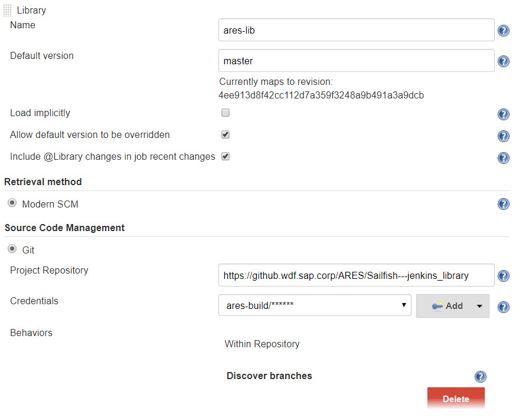

# ARES Jenkins Library

## What you get

This library contains small code pieces to manage different pipeline steps easily and makes the Jenkinsfile quite simple to consume. 
The repository is private due to security reasons. To add this library please check the Jenkins configuration section below. 


## Jenkins configuration

To setup the shared library, you need to perform the following steps:

1. Login to your Jenkins instance with administration privileges.
1. Add the GitHub ares-build user
	1. open `Credentials` -> `System` -> Click on `Global credentials`
	1. click on `Add Credentials`
	1. set *Username* to `ares-build`
	1. set *Password* to the one mentioned in [PassVault](https://cmp.wdf.sap.corp/passvault/#/pwd/0000168075)
1. Open the system configuration page (*Manage Jenkins > Configure System*).
1. Scroll down to end of the section *Global Pipeline Libraries* and add a new Library by clicking the *Add* button.
    1. set *Library Name* to `ares-lib`
    1. set *Default Version* to the `master` branch
    1. set *Retrieval Method* to `Modern SCM`
    1. set *Source Code Management* to `Git`
	1. set *Project Repository* to `https://github.wdf.sap.corp/ARES/Sailfish---jenkins_library`
	1. set *Credentials* to the `ares-build` created earlier
1. Save changes



Now the library is available as `ares-lib` and can be used in any
`Jenkinsfile` by adding this line:

```groovy
@Library('ares-lib') _
```

Jenkins will download the library during execution of the `Jenkinsfile`.
